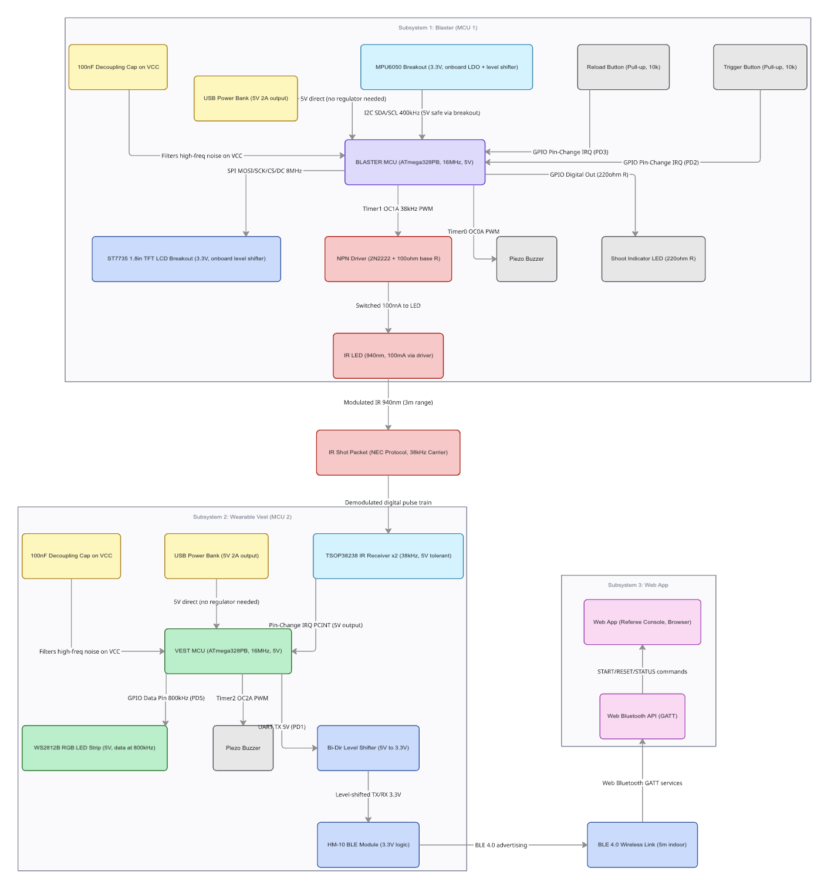
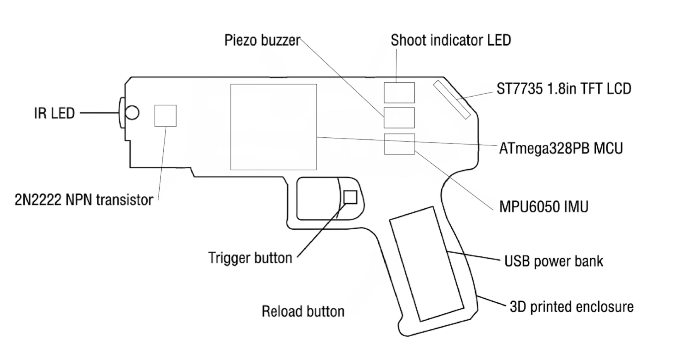
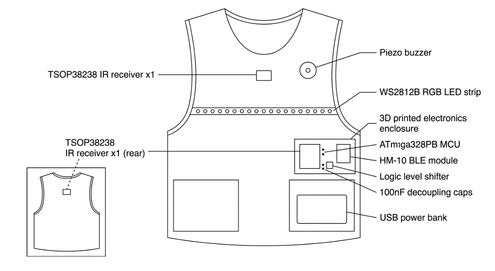
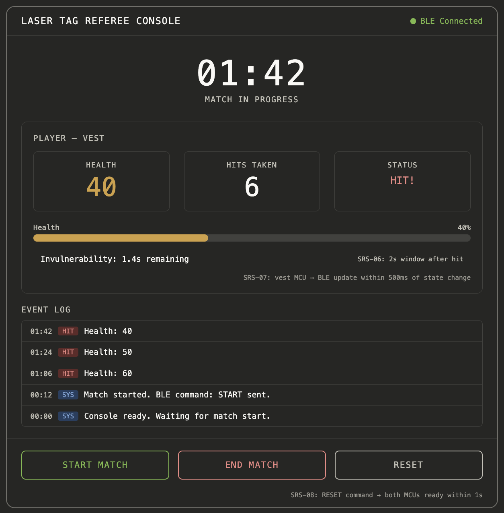
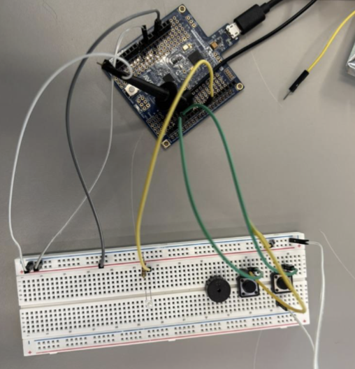
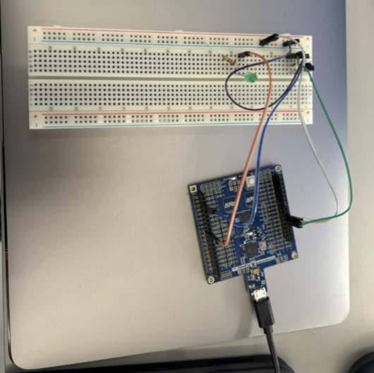

# Final Project

**Team Number: T2**

**Team Name:**

| Team Member Name | Email Address           |
| ---------------- | ----------------------- |
| Marko Mijatovic  | markomij@seas.upenn.edu |
| Devan Malik      | devmalik@seas.upenn.edu |
| Kim Huang        | huangkim@seas.upenn.edu |
| Victor Wanjohi   | vwanjohi@seas.upenn.edu |

**GitHub Repository URL:  [https://github.com/upenn-embedded/final-project-s26-t2]([https://github.com/upenn-embedded/final-project-s26-t2]())**

**GitHub Pages Website URL:** [for final submission]

## Final Project Proposal

### 1. Abstract

This project is a self-contained infrared laser tag system built around two ATmega328PB microcontrollers running bare-metal C. The system consists of a handheld blaster that transmits coded IR packets, a wearable vest that detects and validates hits with audiovisual feedback, and a Bluetooth-linked web application that serves as a referee console for match control and live scoring. The blaster features an LCD display (SPI) for ammo tracking, an MPU6050 accelerometer (I2C) enabling a shake-to-reload gesture, and sound effects via a piezo buzzer. The vest uses multiple IR receivers for coverage, RGB LEDs for hit and health feedback, and communicates match state to the web app over BLE. Together, the system enables a full match loop: start, play, elimination, winner declaration, and reset.

### 2. Motivation

Laser tag is a proven recreational concept, but commercial systems are expensive, proprietary, and offer no insight into the engineering behind them. This project recreates a fully functional laser tag experience from scratch using embedded systems principles, providing a hands-on application of IR communication, real-time firmware state machines, serial peripherals, and wireless connectivity. The project is interesting because it integrates multiple complex subsystems (shooting, hit detection, game logic, wireless comms, and a user-facing web interface) into a single playable product. The intended purpose is a two-player laser tag demo that can run a complete match cycle in under two minutes, showcasing real-time embedded system design at the ESE 3500 final demo day.

### 3. System Block Diagram

The system is composed of three subsystems communicating through IR and BLE:

Blaster (MCU 1 — ATmega328PB): Trigger and reload buttons (GPIO with internal pull-ups and pin-change interrupts), IR LED emitter driven through an NPN transistor (2N2222) switching 100 mA, modulated at 38 kHz via Timer1 output compare, SPI-driven ST7735 LCD breakout (128x160, onboard 3.3V level shifter), MPU6050 IMU breakout over I2C at 400 kHz (onboard LDO and level shifter for 5V-safe operation), piezo buzzer (Timer0 PWM), and a shoot-indicator LED with 220-ohm current-limiting resistor. Powered by a USB power bank providing 5V directly (no voltage regulator needed). 100 nF decoupling capacitors on MCU VCC pins.

Vest (MCU 2 — ATmega328PB): Two TSOP38238 IR receivers (5V-tolerant output, connected via pin-change interrupts for hit detection), WS2812B RGB LED strip (5V, 800 kHz data line), piezo buzzer (Timer2 PWM), and an HM-10 BLE module (3.3V logic) connected through a bidirectional logic level shifter on UART TX/RX lines at 9600 baud. The vest MCU runs game state logic (health tracking, invulnerability windows, elimination detection) and reports status to the web app via BLE. Powered by a USB power bank providing 5V directly. 100 nF decoupling capacitors on MCU VCC pins.

Web App (Referee Console): A browser-based application using the Web Bluetooth API that connects to the vest's BLE module. Provides match start/reset commands and displays live player health, ammo (relayed), hit events, and winner/loser at match end.

Communication Protocols

IR (Gun → Vest): 38 kHz modulated carrier with NEC-style packet encoding (preamble + shooter ID + team ID + CRC)

SPI (MCU 1 → LCD): ST7735 display driven over hardware SPI

I2C (MCU 1 → MPU6050): Accelerometer/gyroscope for shake-to-reload gesture detection on the blaster

UART (MCU 2 → HM-10 BLE): Serial link at 9600 baud through a bidirectional 5V/3.3V logic level shifter

GPIO + Interrupts: Button inputs (trigger, reload), IR receiver hit detection via pin-change interrupts

Topics Covered

Timers: PWM for IR carrier generation (38 kHz), buzzer tones, and LED brightness/patterns

Interrupts: Button debouncing, IR receiver packet detection, timer overflow for game timing

Serial Communication (SPI + I2C + UART): LCD display over SPI, MPU6050 accelerometer over I2C, BLE module over UART (satisfies I2C/SPI requirement with both protocols)

(Advanced) Wireless Communication: IR shot protocol design + BLE connectivity for remote match control

### 4. Design Sketches

#### Blaster

Handheld enclosure (3D printed or laser-cut) housing the ATmega328PB on perfboard, IR LED at the barrel tip driven by a 2N2222 NPN transistor, trigger and reload buttons on the grip, an ST7735 LCD breakout on the back face visible to the shooter, an MPU6050 IMU breakout mounted inside for shake-to-reload detection, a piezo buzzer, and a shoot-indicator LED. Powered by a USB power bank (5V direct, no regulator needed). Decoupling capacitors on all IC power pins.

#### Vest

A fabric vest or harness with 3D-printed/laser-cut mounting points for two IR receivers (front and back), WS2812B RGB LEDs for hit feedback visible to other players, a piezo buzzer for audio cues, and a small enclosure for the ATmega328PB, bidirectional level shifter, and HM-10 BLE module. Powered by a USB power bank (5V direct).

#### Manufacturing

3D printing (Tangen Hall / RPL): blaster enclosure, vest sensor mounts

Laser cutting (RPL): potential flat panels for enclosure sides, vest backing plate

### 5. Software Requirements Specification (SRS)

**5.1 Definitions, Abbreviations**

IR: Infrared. BLE: Bluetooth Low Energy. CRC: Cyclic Redundancy Check. PWM: Pulse Width Modulation. SPI: Serial Peripheral Interface. I2C: Inter-Integrated Circuit. UART: Universal Asynchronous Receiver-Transmitter. IMU: Inertial Measurement Unit. HRS: Hardware Requirements Specification. LCD: Liquid Crystal Display. MCU: Microcontroller Unit.e

**5.2 Functionality**

| ID     | Description                                                                                                                                                                                                                                                                                                   |
| ------ | ------------------------------------------------------------------------------------------------------------------------------------------------------------------------------------------------------------------------------------------------------------------------------------------------------------- |
| SRS-01 | The blaster firmware shall transmit a valid IR shot packet within 50 ms of a trigger press, containing a preamble, shooter ID (4 bits), team ID (2 bits), and CRC-8 checksum.                                                                                                                                 |
| SRS-02 | The blaster firmware shall enforce a minimum inter-shot interval of 500 ms (±50 ms) to prevent shot spamming, blocking trigger input during the cooldown period.                                                                                                                                             |
| SRS-03 | The blaster firmware shall decrement the ammo counter on each valid shot and block firing when ammo reaches zero. The LCD shall update the displayed ammo count within 100 ms of a shot.                                                                                                                      |
| SRS-04 | The reload mechanic shall support two modes: (a) a continuous 10-second (±0.5 s) button hold, or (b) a shake-to-reload gesture detected by the MPU6050 (see SRS-09). For button reload, releasing early shall cancel the attempt. Successful reload via either method shall reset ammo to the maximum value. |
| SRS-05 | The vest firmware shall validate incoming IR packets by checking carrier frequency presence, correct packet framing, and CRC integrity. Invalid packets shall be discarded without affecting game state.                                                                                                      |
| SRS-06 | Upon a valid hit, the vest firmware shall enforce an invulnerability window of 2 seconds (±200 ms) during which additional hits are ignored, preventing double-counting from a single shot burst.                                                                                                            |
| SRS-07 | The vest firmware shall transmit updated player status (health, eliminated flag) to the BLE module via UART within 500 ms of any game state change (hit received, elimination, reset).                                                                                                                        |
| SRS-08 | Upon receiving a RESET command from the web app via BLE, both MCUs shall return to their initial ready state (full health, full ammo, ALIVE status) within 1 second.                                                                                                                                          |
| SRS-09 | The blaster firmware shall read the MPU6050 accelerometer via I2C at a minimum rate of 20 Hz and detect a shake-to-reload gesture when acceleration exceeds 2g on any axis for at least 3 consecutive samples. The gesture shall initiate the reload sequence as an alternative to the button hold.           |

### 6. Hardware Requirements Specification (HRS)

**6.1 Definitions, Abbreviations**

FOV: Field of View. dB: Decibels. SNR: Signal-to-Noise Ratio. PCB: Printed Circuit Board. LDO: Low Dropout Regulator. NPN: Negative-Positive-Negative (transistor type). BSS138: N-channel MOSFET used in level shifter circuits.

**6.2 Functionality**

| ID     | Description                                                                                                                                                                                                                                                                  |
| ------ | ---------------------------------------------------------------------------------------------------------------------------------------------------------------------------------------------------------------------------------------------------------------------------- |
| HRS-01 | The IR emitter circuit shall use an NPN transistor (2N2222 or equivalent) to drive a 940 nm IR LED at 100 mA, producing a 38 kHz (±1 kHz) modulated carrier signal detectable by a TSOP38238 receiver at a minimum range of 3 meters in indoor ambient lighting conditions. |
| HRS-02 | The vest shall incorporate a minimum of two IR receiver modules (TSOP38238 or equivalent) providing front and rear hit detection coverage.                                                                                                                                   |
| HRS-03 | The LCD display (ST7735 or equivalent, minimum 128x128 pixels, SPI interface) shall be visible to the player under normal indoor lighting and update at a minimum refresh rate of 5 fps for game state information.                                                          |
| HRS-04 | The HM-10 BLE module (3.3V logic) shall connect to the vest MCU (5V logic) through a bidirectional logic level shifter on UART TX/RX lines at 9600 baud, and sustain a BLE link to the web app at distances up to 5 meters indoors.7. Bill of Materials (BOM)                |
| HRS-05 | The piezo buzzers on both the blaster and vest shall produce audible feedback at a minimum of 65 dB at 30 cm distance, with distinct tones for shot fired, hit received, elimination, and reload complete events.HRS-06**HRS-06****HRS-06**                            |
| HRS-06 | The blaster and vest shall each be powered by USB power banks providing 5V directly, with a minimum capacity of 5000 mAh supporting at least 60 minutes of continuous gameplay without requiring a recharge.                                                                 |
| HRS-07 | Each ATmega328PB shall operate at 16 MHz with a 5V supply from the USB power bank. Each MCU VCC pin shall have a 100 nF ceramic decoupling capacitor to filter high-frequency noise. Total system current draw per subsystem shall not exceed 500 mA.                        |
| HRS-08 | The LED feedback system on the vest shall provide visually distinct patterns for hit (flash), low health (pulsing), and eliminated (solid or rapid flash) states, visible from at least 2 meters in normal indoor lighting.                                                  |
| HRS-09 | The MPU6050 IMU shall be mounted rigidly inside the blaster enclosure and communicate with the ATmega328PB over I2C at 400 kHz. The accelerometer shall be configured for a ±4g range with 16-bit resolution.                                                               |

### 7. Bill of Materials (BOM)

| Component           | Part / Model                                          | Qty     | Unit Cost | Vendor             | Purpose                                |
| ------------------- | ----------------------------------------------------- | ------- | --------- | ------------------ | -------------------------------------- |
| Microcontroller     | ATmega328PB                                           | 2       | Kit       | Lab / Kit          | Blaster + Vest MCUs                    |
| LCD Display         | ST7735 1.8" TFT breakout (SPI, onboard level shifter) | 1       | ~$10      | Adafruit           | Blaster ammo display                   |
| IMU                 | MPU6050 breakout (I2C, onboard LDO + level shifter)   | 1       | ~$4       | Adafruit           | Shake-to-reload gesture                |
| IR Emitter LED      | 940nm IR LED (5mm)                                    | 2       | ~$1       | Adafruit / DigiKey | Shot transmission                      |
| NPN Transistor      | 2N2222 + 100Ω base resistor                          | 2       | ~$0.50    | Lab / DigiKey      | IR LED driver (100mA)                  |
| IR Receiver         | TSOP38238 (38kHz)                                     | 3–4    | ~$2 ea    | Adafruit / DigiKey | Vest hit detection                     |
| BLE Module          | HM-10 (3.3V UART)                                     | 1       | ~$6       | Amazon / Adafruit  | Vest-to-web-app link                   |
| Logic Level Shifter | Bi-dir 3.3V/5V (BSS138)                               | 1       | ~$4       | Adafruit           | UART level shift for HM-10             |
| Piezo Buzzer        | Passive piezo                                         | 2       | ~$1 ea    | Adafruit / DigiKey | Audio feedback                         |
| RGB LEDs            | WS2812B strip                                         | 1 strip | ~$8       | Adafruit           | Vest hit/health feedback               |
| Buttons             | Tactile pushbuttons                                   | 3–4    | ~$0.50 ea | Lab / DigiKey      | Trigger, reload, reset                 |
| USB Power Banks     | 5V 2A output, 5000mAh+                                | 2       | ~$8 ea    | Amazon             | 5V power for each unit                 |
| Passives + Misc     | 100nF caps, 220Ω/100Ω resistors, perfboard, wires   | —      | ~$10      | Lab / Kit          | Decoupling, current limiting, assembly |

Estimated Total: ~$70–$90

### 8. Final Demo Goals

On demo day, the system will be demonstrated as a live two-player laser tag match at a lab station in Detkin Lab. One team member will wear the vest and another will hold the blaster while someone else operates the web app on a laptop as the referee. The demo will follow this sequence:

* Referee starts the match from the web app
* Player fires the blaster at the vest, showing IR hit detection, LCD ammo decrement, and vest LED/buzzer feedback in real time
* Player runs out of ammo and performs the shake-to-reload gesture (or 10-second button hold as fallback)
* Vest player is eliminated (health reaches zero), vest shows elimination feedback, web app declares result
* Referee resets the match from the web app, all devices return to ready state

#### Constraints

* Demo will be conducted at a single lab station (no outdoor space required)
* IR range of ~3 meters is sufficient for the indoor demo area
* All components are USB power bank powered for portability (no wall outlet dependency)

### 9. Sprint Planning

**Sprint Milestones**

| Week          | Milestone                    | Key Tasks                                                                                                                                                           |
| ------------- | ---------------------------- | ------------------------------------------------------------------------------------------------------------------------------------------------------------------- |
| Mar 16–22    | Parts Ordering + Prototyping | Finalize BOM, order parts, begin breadboard prototyping of IR emitter/receiver pair, set up ATmega328PB dev environments                                            |
| Mar 23–30    | Subsystem Bringup            | IR TX/RX communication working, LCD displaying over SPI, BLE module pairing with test web page, buzzer tones verified. Parts ordering meeting with Account Manager. |
| Mar 30–Apr 3 | Sprint 1: Core Firmware      | Blaster state machine (ammo, fire, reload), vest state machine (health, hits, invulnerability). IR packet protocol (encode/decode + CRC). Sprint Review #1.         |
| Apr 4–10     | Sprint 2: Integration        | Integrate blaster and vest for end-to-end shot-hit cycle. BLE commands from web app controlling game state. Begin mechanical enclosure work. Sprint Review #2.      |
| Apr 11–17    | MVP Demo                     | All electronics and firmware functional at basic level. Full match loop working (start, shoot, hit, eliminate, reset). Enclosures in progress. MVP Demo on Apr 17.  |
| Apr 18–24    | Polish + Final Demo          | Finalize enclosures, polish web app UI, tune IR range/reliability, stress test full system. Final Demo Apr 24.                                                      |
| Apr 25–27    | Final Report                 | Record demo video, write validation results for SRS/HRS, complete GitHub Pages website. Due Apr 27.                                                                 |

| Member | Primary Responsibility                                    | Secondary                                    |
| ------ | --------------------------------------------------------- | -------------------------------------------- |
| Kim    | Blaster firmware (state machine, IR TX, LCD driver)       | IR protocol co-design                        |
| Devan  | Vest firmware (hit detection, game logic, BLE UART)       | IR protocol co-design                        |
| Marko  | Web app (BLE integration, match UI, referee controls)     | BLE protocol definition, integration testing |
| Victor | Hardware & mechanical (circuits, power, enclosures, vest) | Integration, soldering, 3D print / laser cut |

**This is the end of the Project Proposal section. The remaining sections will be filled out based on the milestone schedule.**

## Sprint Review #1

### Last week's progress

Blaster (MCU1) — Kim & Victor:

* Trigger and reload buttons wired with GPIO and internal pull-ups ,confirmed functional on breadboard.
* IRemitter circuit assembled: 940 nm IRLED driven through 2N2222NPN transistor, switching ~100mA off a GPIO-controlled base pin.

* ATmega328PB dev environment setup and running bare-metal C on the blaster MCU.

Vest (MCU2) — Devan&Marko:-

* TSOP38238 IR receiver wired with 100nF decoupling cap on VCC (required by data sheet for stable operation).
* Confirmed it detect 38kHz modulated IR from the blaster emitter.
* Basic hit detection prototype working: LED lights on valid IR detection via pin-change interrupt.
* Vest ATmega328PB brought upon the breadboard.

Design Change — BLE → Feather ESP32

* Pivoted from the HM-10 BLE module to an Adafruit Feather ESP32 for the wireless link between the vest and web app.
* The Feather provides Wi-Fi + BLE flexibility and a more mature software ecosystem for the web app side.
* It still serves strictly as a communications module (no application logic — all game logic remains on the ATmega328PB per course restrictions).

### Current state of project

Core subsystems are individually coming online on breadboards. The IR TX → RX link is proven at the physical layer.

The BLE-to-Feather pivot is a scope adjustment and does not affect the ATmega firmware architecture—the Feather simply replaces the HM-10 on the UART lines.

**Hardware status:**

* All critical components are in hand (ATmega328PBs, TSOP38238s, IR LEDs, 2N2222s, ST7735 LCD, MPU6050).
* Feather ESP32 is on hand.
* No outstanding part orders are blocking progress.

**Risk:**

* IR packet reliability at a 3 m range has not been tested yet; this is a key validation target for the next sprint.

### Next week's plan

| Task                                        | Time   | Owner                  | Definition of Done                                                                                    |
| ------------------------------------------- | ------ | ---------------------- | ----------------------------------------------------------------------------------------------------- |
| Feather ESP32 +  Web App BLE link      | 2–4 h | Marko                  | Feather pairs with browser via Web Bluetooth API;  can send/receive test strings bidirectionally |
| ST7735 LCD over SPI                         | 1–2 h | Kim                    | LCD displays static ammo count on blaster MCU                                                         |
| MPU6050 I2C bringup                         | 1–2 h | Kim / Devan            | Read raw accelerometer values over I2C at 400 kHz, print to serial                                    |
| Piezo buzzer tones                          | 10 m   | Victor                 | Timer-driven PWM produces distinct tones for shot/hit/reload events                                   |
| Migrate to circuit boards  (perfboard) | 2 h    | Victor / Devan / Marko | Blaster and vest circuits soldered on perfboard, off breadboard                                       |

## Sprint Review #2

### Last week's progress

Piezo Buzzer - Victor

- Buzzer functions and can play 4 diferent tones:
  - Blaster fire
  - Vest hit
  - Reload
  - Out of ammo

IMU - Devan

- the IMU works over serial
- reports when it eperiences a high threshold shaking event, signifying a reload

Web app - Marko

- web app dashboard built
- can simulate games and game behavior

LCD Screen - Kim

- LCD screen working to display blaster shots and reload

### Current state of project

### Next week's plan

## MVP Demo

## Final Report

Don't forget to make the GitHub pages public website!
If you’ve never made a GitHub pages website before, you can follow this webpage (though, substitute your final project repository for the GitHub username one in the quickstart guide):  [https://docs.github.com/en/pages/quickstart](https://docs.github.com/en/pages/quickstart)

### 1. Video

### 2. Images

### 3. Results

#### 3.1 Software Requirements Specification (SRS) Results

| ID     | Description                                                                                               | Validation Outcome                                                                          |
| ------ | --------------------------------------------------------------------------------------------------------- | ------------------------------------------------------------------------------------------- |
| SRS-01 | The IMU 3-axis acceleration will be measured with 16-bit depth every 100 milliseconds +/-10 milliseconds. | Confirmed, logged output from the MCU is saved to "validation" folder in GitHub repository. |

#### 3.2 Hardware Requirements Specification (HRS) Results

| ID     | Description                                                                                                                        | Validation Outcome                                                                                                      |
| ------ | ---------------------------------------------------------------------------------------------------------------------------------- | ----------------------------------------------------------------------------------------------------------------------- |
| HRS-01 | A distance sensor shall be used for obstacle detection. The sensor shall detect obstacles at a maximum distance of at least 10 cm. | Confirmed, sensed obstacles up to 15cm. Video in "validation" folder, shows tape measure and logged output to terminal. |
|        |                                                                                                                                    |                                                                                                                         |

### 4. Conclusion

## References
