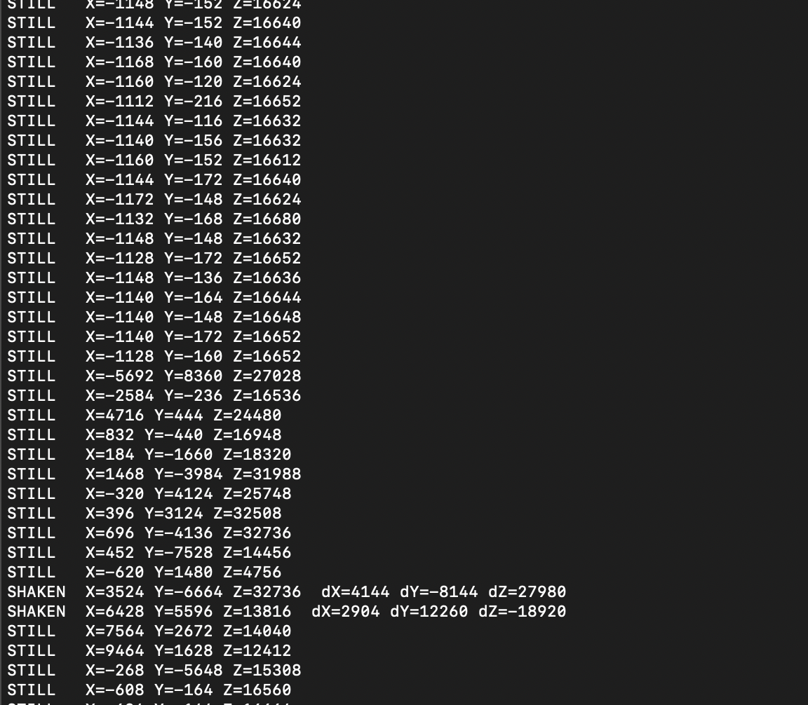

## Sprint Review #2

### Last week's progress

Piezo Buzzer - Victor

- Buzzer functions and can play 4 diferent tones:
  - Blaster fire
  - Vest hit
  - Reload
  - Out of ammo

IMU - Devan

- the IMU works over I2C
- reports when it eperiences a high threshold shaking event, signifying a reload

Web app - Marko

- web app dashboard built
- can simulate games and game behavior

LCD Screen - Kim

- LCD screen working to display blaster shots and reload

### Current state of project

All subsystems with the exception of the feather connection are functining as expected. Every individual component: the buzzers, the IR LED, the IR reciever, the web app, the LCD screen, and the IMU are functioning and have code written for them. What's left is to integrate all of them and build out the polished housings. Individual comms between each subsystem and the MCU is funcitoning: I2C for the IMU and SPI for the LCD screen.

### Next week's plan

Over the next week, our primary focus is completing afirst-pass full system integration in preparation for the MVP demo. While all individual subsystems are currently functional in isolation, the key challenge now is ensuring that they operate reliably together under a unified firmware architecture.

On thefirmware side , we will begin by merging all existing drivers and modules into a single codebase, including the IR transmission and reception logic, LCD display updates, IMU-based input handling, and buzzer/LED feedback. This will require designing a clear state machine to manage gameplay states such as idle, firing, hit detection, reload, and reset. We will also implement non-blocking timing mechanisms using timers and interrupts to ensure that multiple subsystems can operate concurrently without interfering with each other.

A major priority will be integrating the Bluetooth communication via the Feather module , which is currently the only incomplete subsystem. We plan to establish reliable UART communication between the main MCU and the Feather, define a simple message protocol, and enable core functionality such as remote reset commands and periodic status updates to the web app.

By the end of the week, our goal is to have a minimally integrated but fully playable system  where a user can fire the blaster, register hits on the vest, receive feedback, and reset the game through the web interface. This will allow us to identify integration issues early and iterate before the final demo.
